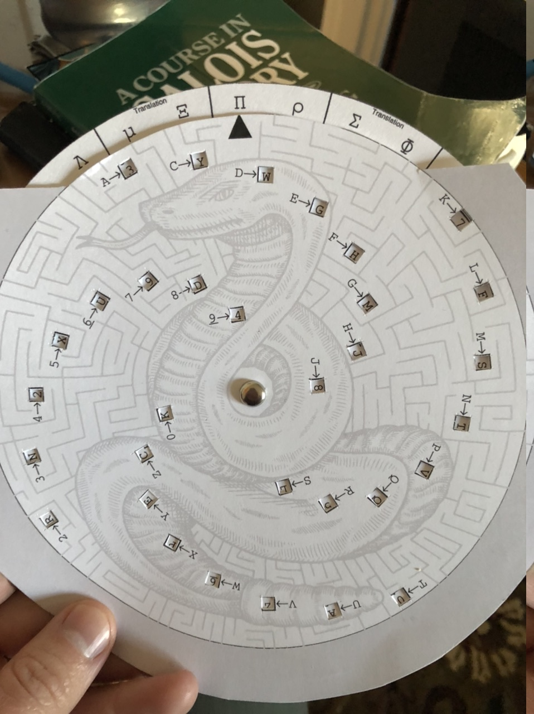
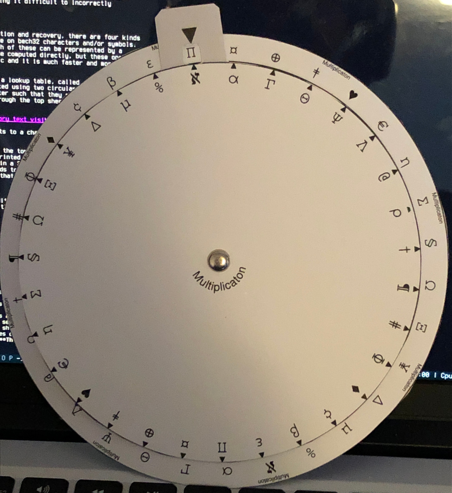

# High-Level Introduction

The SSS32 package describes a way for users, assisted by paper computers in the
form of slide charts (volvelles) and circular slide rules, to perform checksumming
and Shamir Secret Sharing on their Bitcoin secrets.

With this said, we made **no cryptographic compromises** (except that we lack the
ability to support passphrases or key hardening, instead relying on dice rolls
to have sufficient entropy) for the sake of enabling hand-computation. This would
be a perfectly secure and reasonable scheme to use for secret storage even for
users who are willing and able to use electronic computers. Although such users
may prefer to use the more-popular
[SLIP39](https://github.com/satoshilabs/slips/blob/master/slip-0039.md) scheme,
which also supports passphrases, and allows users to split their secret into
more than 31 shares.

## Bitcoin and Seed Values

The most common way that Bitcoin wallets derive addresses is using a scheme
developed in 2012 by Pieter Wuille called
[BIP32 Hierarchical Derivation](https://github.com/bitcoin/bips/blob/master/bip-0032.mediawiki),
known more commonly as "HD Keys". Under this scheme, a single uniformly random
"master seed", which is typically 128 or 256 bits in length, can be used to
derive an effectively unlimited number of Bitcoin addresses, largely eliminating
the need for frequent backups.

Most users interact with BIP32 master seeds indirectly, for example by storing a
set of 12 or 24 [BIP39](https://github.com/bitcoin/bips/blob/master/bip-0039.mediawiki)
or [SLIP39](https://github.com/satoshilabs/slips/blob/master/slip-0039.md) seed words.
These seed words are transformed, using a password-protected hardening function and/or
a hash, into a BIP32 master seed, which is then used by the wallet to derive elliptic
curve keys for addresses.

It is possible to convert from a set of seed words to a master seed, though in the
case of BIP39 the reverse conversion is not possible. For this reason, while this
package is primarily focused on storing 128-bit master seeds, we also provide a
module for storing (and restoring) BIP39 seed words.

## Shamir Secret Sharing

There is an inherent trade-off between the availability of a secret and its
risk of theft. If a user makes many copies of her seed words, one of them may
eventually fall into the wrong hands. But if she makes too few, then they all
may become lost, destroyed or misplaced. The consequence in either case is
a total loss of funds.

One way to achieve higher redundancy with less risk is *secret sharing*, in
which the key is spread across N *shares*, and any K of these shares are
sufficient to reconstruct the original key. For example, if K = 2 and N = 3,
the user might store her key across three secure locations, and if one of
those becomes unavailable, the remaining two are sufficient to get the key.
On the other hand, if one of the locations is accessed by an attacker, the
key remains safe.

There is a simple way to do 2-of-3 secret sharing with a 24 seed words:
store the first 16 in one location, the last 16 in another, and the first
and last 8 in yet a third. Then each individual location is missing eight
words (and eight words, representing at least 80 bits of information,
very probably cannot be guessed). However, this scheme is on the edge of
what can reasonably be considered secure, and is very fragile to partial
leakage. (If an attacker gains the first 16 words, and later learns four
of the remaining ones, the last four will not be too hard to guess.) It
also requires the user to use a 24-word seed phrase, even though 12 would
otherwise be sufficiently secure, and it does not generalize beyond 2-of-3.

There is a more sophisticated way of splitting up secrets, due to cryptographer
[Adi Shamir](https://en.wikipedia.org/wiki/Adi_Shamir) based on the work of
mathematician [Joseph-Louis Lagrange](https://en.wikipedia.org/wiki/Joseph-Louis_Lagrange),
known as [Shamir's Secret Sharing](https://en.wikipedia.org/wiki/Shamir%27s_Secret_Sharing)
or SSS.

SSS can be used to split a secret, of arbitrary length, into an arbitrary
number of shares, such that the secret can be constructed by a certain number
(the *threshold*) of them. The threshold is determined at the time that the
shares are created. There are a number of limitations to SSS which have
plagued past implementations of the scheme:
* First, no matter how it is implemented, SSS requires that the original
secret be reconstructed on a single piece of hardware before it can be
used. Therefore, if at all possible, it is better to use
[threshold signatures](https://en.bitcoin.it/wiki/OP_CHECKMULTISIG) instead.
* SSS requires the generation of extra random data beyond the original secret,
which [must be generated securely](https://bitcointalk.org/index.php?topic=2199659.0)
* If any share is corrupted, the reconstructed secret will be wrong and it is
impossible to determine which share (or how many shares) was responsible

The latter issues have been addressed, by the clever use of error-correcting
codes, in Satoshi Labs' [SLIP39](https://github.com/satoshilabs/slips/blob/master/slip-0039.md)
protocol, but the fact remains that SSS involves a single point of failure
at the time that the secret key material is actually used. We emphasize that
SSS is a mechanism for **storing backups** and not a mechanism for **enforcing
a signing policy**.

Having said that, SLIP39 has one big limitation: that it requires the use of
electronic computing hardware (e.g. a Trezor) to create shares, validate
checksums, and reconstruct secrets. We discuss this in the next section.

(It also has the small limitation that it could've used a bigger error correction
code, which we also addressed, but which is very unlikely to be a problem in
practice.)

## Computers and Trust

It is infeasible to  sign Bitcoin transactions without the aid of electronic
computers, which are needed to perform elliptic curve operations and SHA256
hashes. To do this, these computers need access to secret key material, which
puts the user in an uncomfortable position: this key material, if misused
(or initially generated without sufficient randomness), can be used to steal
all of the users' coins. And there is no way for the user to be assured of
what, exactly, an electronic computer is doing with her keys.

General-purpose computers are so complex and exposed to so much adversarial
input (in the form of Internet connections, running arbitrary programs, and
being exposed to many users) that users are advised to never expose their
key material to such machines. Instead, they provide their seed words to
hardware wallets, which interact with host computers through a narrow interface
which never reveals secret key data in any form.

However, even hardware wallets are opaque and inscrutable, and there are many
reasons to consider their use risky:
* They may have bugs which cause key leakage, either now or as a consequence
of some future firmware update.
* They may store key material in a physical form which can be extracted by an
attacker with physical access, even after it has been "deleted" from the
perspective of the wallet itself.
* They may expose data through *side channels*, such as the electromagnetic
waves emitted by processor activity, or a varying power draw from an untrustworthy
USB port.
* If tasked with generating random data, they may do so with insufficient entropy.

Furthermore, when working with Shamir Secret Sharing, it is necessary to handle
secret key data, and expose secret shares to the user, which introduces a new
set of risks -- how can the hardware wallet be sure that it is communicating
only with the correct user under the correct circumstances?

These risks have varying degrees of plausibility, but the fact is that no matter
how trustworthy the hardware or its manufacturer, these are nontrivial risks and
over the lifetime of a Bitcoin secret (which may, perhaps, exceed any one human's
lifetime), they add up to a very serious risk.

Unlike electronic computers, paper cannot "remember" secret data, and when handled
correctly it cannot leak secret data, and these facts can be readily ascertained
with no special skills or equipment. We propose then, to provide the user a way to
* Compute and verify very powerful checksums (see the next section)
* Split their secret into up to 31 "shares", of which some number are needed to
reconstruct the secret (see the previous section)
* Recombine their secret, perhaps to redo the splitting if some old shares are
compromised
* Recursively split shares, so that they may themselves be spread across multiple
parties

using only pencil and paper (and brass fasteners). In this way, coins which do
not need to be spent may have their secure storage refreshed or reorganized an
arbitrary number of times, without the uncertainty and risk associated with
electronic computers ever entering the picture.

## Checksumming and Error Correction

When users are storing key data, it is possible that errors may arise, especially
during the initial storage, or when the data is being copied or transferred to a
new container. Errors might also crop up during long-term storage, for example
if Cryptosteel tiles are subjected to extreme heat which makes some letters
unclear, or if a seed word stored on paper suffers water damage.

In this scheme, users will also be doing finicky and time-consuming computations
on their seed data, without the aid of electronic computers, and it is very likely
that errors will appear during these computations.

Both BIP39 and SLIP39, in addition to encoding the raw cryptographic data, also
store a *checksum*, which is a small amount of extra redundant data used to
detect errors. BIP39's checksum is less than one word long, will fail to detect
errors with probability 1/256, and cannot reliably correct any number of errors.
It is also effectively impossible to compute or verify by hand.

SLIP39, by contrast, can detect up to 3 errors and correct up to one error 100%
of the time, and will fail to detect other errors with probability roughly one
in a billion. However, the SLIP39 checksum is also very difficult to compute or
verify by hand.

In this scheme, we introduce a new checksum, *russ32* (lol let's rename this -AP),
which can detect up to *8* errors, correct up to 4, and has probability less than
one in a million million million of failing to detect other random errors. Further,
russ32 checksums can be computed and verified entirely by hand,

# Detailed Introduction

We now give a detailed introduction to the contents of this package and its
usage. This will be followed by a tutorial in the form of a worked example.
Ambitious users are free to skip past this all to the actual content, the
worksheets, which have self-contained instructions.

## Bech32 and the Alphabet

In order to store 128-bit secrets, SSS32 borrows the
[Bech32 alphabet](https://github.com/bitcoin/bips/blob/master/bip-0173.mediawiki)
which provides 32 5-bit characters. These characters consist of the 26 letters
of the Latin alphabet and 10 arabic numerals, except `B` (which looks like 8),
`O` (which looks like 0), `I` and `1` (which look like each other, and like
non-character vertical lines).

The alphabet, in natural ordering, is `ACDEFGHJKLMNPQRSTUVWXYZ023456789`.

We also use an alternate alphabet, consisting of non-Latin symbols, which is
only used for intermediate computations. It is never used for storage, and
nothing represented in this alphabet is ever secret data.

| Symbol | Name |
|---|------|
| × | cross |
| ℵ | aleph |
| α | alpha |
| β | beta |
| Γ | gamma |
| ∆ | delta |
| ε | epsilon |
| η | eta |
| Θ | theta |
| Λ | lambda |
| µ | mu |
| Ξ | xi |
| Π | pi |
| ρ | rho |
| Σ | sigma |
| Φ | phi |
| Ψ | psi |
| Ω | omega |
| @ | at |
| # | pound |
| % | percent |
| ¢ | cent |
| ¥ | yen |
| € | euro |
| ¤ | scarab |
| ⊕ | circle-plus |
| † | dagger |
| ‡ | double-dagger |
| § | section |
| ¶ | paragraph |
| ♦ | diamond |
| ♥ | heart |

Users do not need to know the correspondence of this alphabet to bitstrings,
or to each other, although curious users are encouraged to read the
[mathematical companion](https://github.com/apoelstra/SSS32/blob/2021-12--math-intro/volvelles/main.tex).
The purpose of having two alphabets is to
guide the computational process, by making it difficult to incorrectly
combine different sets of data.

## Generating Random Bech32 Characters

The following is a scheme for generating random bech32 characters, using five
distinguishable dice. (For example, five ordinary six-sided dice of different
colors would work. But you don't need to use six-sided dice, or even dice with
the same number of sides as each other, so there is a lot of flexibility.)

Then to generate a single Bech32 character, roll the five dice. Note each die's
value. Roll them again. Then, for each die,

* If the second roll was greater than the first, mark a 1
* If the second roll was less than the first, mark a 0
* If the second roll was equal to the first, roll that die again until it's not.

You will get a five bit number. For example, 10110. Look this value up in the
following table:

| `00000: Q` | `00001: P` | `00010: Z` | `00011: R` |
| `00100: Y` | `00101: 9` | `00110: X` | `00111: 8` |
| `01000: G` | `01001: F` | `01010: 2` | `01011: T` |
| `01100: V` | `01101: D` | `01110: W` | `01111: 0` |
| `10000: S` | `10001: 3` | `10010: J` | `10011: N` |
| `10100: 5` | `10101: 4` | `10110: K` | `10111: K` |
| `11000: C` | `11001: E` | `11010: 6` | `11011: M` |
| `11100: U` | `11101: A` | `11110: 7` | `11111: L` |

## Tables, Volvelles, and Slide Rulers

Throughout the checksumming, share creation and recovery, there are four kinds
of basic arithmetic that need to be done on bech32 characters and/or symbols.
Since there are only 32 characters, each of these can be represented by a
32-by-32 lookup table. (They can also be computed directly, but these operations
do not correspond to familiar arithmetic and it is much faster and more reliable
to do lookups.)

However, there is an alternate form of a lookup table, called a slide chart or
**volvelle**. Such a table is constructed using two circular sheets of paper
or cardstock, fastened through the center such that they can rotate relative
to each other, and with windows cut through the top sheet to allow symbols on
the bottom sheet to be revealed.

#

The top sheet has a pointer which points to a character printed on the outside
of the bottom sheet.

Our volvelles have 32 windows cut into the top sheet, each labelled by a bech32
character, and have 31 or 32 symbols printed on the outside of the bottom sheet.
This allows the user to do a "lookup" in a 32x31 or 32x32 table by spinning the
volvelle so that the pointer corresponds to the row they intend to look up, and
then finding the appropriate entry in that row by looking through the windows.

We have three volvelles, labelled "Addition", "Translation" and "Recovery", whose
roles will become clear as we explain the creation and recovery processes.

As well as volvelles, we one **circular slide rule** whose operation is more
straightforward: it allows "multiplication" of one symbol by any other by
spinning the top wheel to point to the first symbol. Every symbol is printed
on the outside of the top wheel; look up the second symbol there, and you
will see it pointing to the result on the outside of the bottom wheel.

#

The different paper computers are used in the following scenarios:
* In checksum computation and creation of initial shares, only the Addition volvelle is needed.
* To create further shares, the Addition and Translation volvelles are needed.
* To recover a secret in a 2-of-n split, all three volvelles are needed.
* To recover a secret in a k-of-n split where k is 3 or more, all volvelles and the slide rule are needed.

The volvelle data are all provided first in the form of ordinary tables. Then
the volvelles themselves are provided in Module 0 in the form of printed circles
that need to be cut out and assembled.

We recommend you keep the tables, and these instructions, with your stored
secrets. This way, even if you lose the volvelles (which need to be cut out
and are oddly shaped), it is still possible to work through the recovery process.
And of course, all of this is available freely on the Internet.

## Storage and Headers

To store 128-bit secrets, we round 128 up to 130, so that the secret can be
represented by 26 bech32 characters. We prefix this with the 3 characters
`ms1` and a 6-character header, and suffix it with a 13-character checksum:

| Human-readable Part | Threshold | Secret ID | Share Index | Secret data | Checksum |
|---------------|--------|---------|--------|----------|----------|
| 3 characterss (`ms1`) | 1 character | 4 characters | 1 character | 26 characters | 13 characters |

The components of the header are:
* The **threshold** indicates what the secret sharing threshold is, and should be
a digit between `2`and `9` inclusive. Higher threshold values are not supported
by the header format. If the user does not intend to use secret sharing, she
should instead use `0`.
* The **secret ID** is four characters which can be anything at all. They should
be the same for all shares of a given secret, and distinct between secrets.
* The **share index** indicates which share this is, and may be of the 32
available characters except `S`. Shares conventionally are generated in order
(`A`, then `C`, `D`, `E` and so on). **The secret itself has share ID `S`**,
which may not be used for other shares. If the user is not using secret sharing,
she should just put `S` here.

We will explain the share splitting process in more detail over the next two
sections.

## Initial Share Generation

There are two scenarios that we support in this document.
* They want to generate a checksummed secret, and do not care about SSSS.
* They want to generate a split secret with threshold k ≥ 2, such that any k shares
  can be used to regenerate a secret

In the case that the user has an existing secret in the form of BIP39 words,
a similar but more complicated process is required, which is covered in Module 1.
We do not discuss it here.

The process for both cases begins in roughly the same way.

### Unshared Checksummed Secret

For an unshared checksummed secret, the process is:

1. Generate a 6-character header from the bech32 alphabet. The first character
   should be `0` and the last character `S`, and the middle 4 can be arbitrary,
   but should be chosen to make the
2. Generate 26 random characters, representing 130 bits of entropy. Add these
   after the header.
3. Follow the instructions on the "Checksum Worksheet" to generate a 13-character
   checksum after the end of the random data.
4. Follow the instructions on a fresh "Checksum Worksheet" to validate the checksum
   to double-check that you did not make any mistakes.

The checksum worksheet is likely to take 30-90 minutes, depending on user proficiency
with the Addition volvelle. Even though this is a long time, it is important to do
it twice (once in step 3 and again in step 4) because mistakes made during checksum
computation cannot be corrected after the fact.

### New Split Secret with Threshold k

In this document we require k be between 2 and 9 inclusive, so that it can be
represented by the bech32 characters `2` through `9`.

For a split secret, generate k "initial shares" using exactly the same steps as
in the Unshared Checksummed Secret case. The only difference is that in Step 1,
`0` should be replaced with the digit k, and `S` should be replaced by the share
index.

The first share index should be `A`, the second `C`, the third `D`, and so on,
following the bech32 alphabet. If you are unsure of the ordering, refer to the
outside of the Addition volvelle.

Once the inital shares are generated, continue to the next section.

## Derived Share Generation

The k initial shares together actually form a set of k-of-k SSSS shares. However,
the user likely would like a k-of-n scheme where n is bigger than k. In this caes,
the user needs to create n-k additional "derived" shares. These are not generated
randomly but instead derived from the initial shares.

The steps are as follows:

1. Follow the instructions on the "Constructing Shares" worksheet: for each of your
   iniital shares, look up a translation symbol in the provided tables and translate
   that share using the Translation volvelle. Then add all the translated shares
   using the Addition volvelle.
2. The result will be a new share, miraculously with a well-formed header and a valid
   checksum. To validate this checksum, fill out a fresh Checksum Worksheet with the
   new share.

It is very likely that you will make mistakes during this process, resulting in a bad
checksum. Mistakes during the translation step are correctable, but the error correction
process involves computers and is not necessary here since the user has all the data
she needs. Further, a bad checksum is just as likely to have resulted from incorrect
computations in the Checksum Worksheet, which the error correction process cannot handle.

The most straightforward way to handle a wrong checksum is to redo the entire share
derivation step, checking each calculation against the first time you did it.

There is a less demoralizing, but more time-consuming, way to do the share derivatio
process:

1. Before beginning, make sure you have complete Checksum Worksheets for all of your
   initial shares (if you just generated these, the worksheets should be readily available).
2. Start the Checksum Worksheet for your derived share, copying the translated share
   into the bold boxes as usual.
3. Repeat the translation-and-adding process, this time taking the **bottom diagonal
   squares** from the initial Checksum Worksheets and combining these. Copy the
   result into the bottom diagonal of the new Checksum Worksheet.
4. Write the target residue `SECRETSHARE32` at the bottom of the Checksum Worksheet.
5. Now filling in the rest of the Checksum Worksheet as usual. If you ever compute a
   value that doesn't match one of your pre-filled squares, you know the mistake was
   in that column. Redo the computations *just for that column* before continuing.

## Distribution of Shares

Once the shares have been generated, there is no difference between the initial and
derived shares. You are free to distribute these as you see fit.

You can generate up to 31 total shares before running out of available letters for
share indices. You can make multiple copies of shares, but of course remember that
only one copy counts during recovery: you need k *distinct* shares to recover your
secret.

## Recovery

Once you have generated and (distributed) your shares, you may like to recover your
secret. In the future, we hope that hardware wallets will accept input of shares
and do the recovery themselves, but we assume for this section that you want to
recover your secret by hand.

First, make sure you have k shares available. Exactly k are needed; if you have
more, then just set the extras aside.

The process is then very similar to the process for share derivation, except that
rather than looking up symbols in a provided table, you use the Recovery Wheel
volvelle to compute them.

### k = 2

If k = 2, the process is as follows:

1. Complete Checksum Worksheets for the k shares you are using. (This is not strictly
   necessary, but if any mistakes happen during the recovery process it's helpful to
   be confident in your original shares' correctness.)
2. For each share that you have, spin the Recover Share volvelle so that it is
   pointing to that share index. Read the symbol from the window of the **other
   share**.
3. Translate this share (the one the volvelle is spun to) using the Translation
   volvelle.
4. Add the translated shares. The result will magically have a valid header and
   share index `S`. This is your secret. Keep it safe.
5. Complete a Checksum Worksheet for the derived secret.

As during share derivation, if you use the checksum worksheets for your input shares,
and repeat the translate-and-add process for the cells in the bottom diagonal, you
can identify mistakes as soon as they happen, avoiding the need to repeat tons of
work if you mess up.

### k > 2

The process for k > 2 is identical, except for step 2, which needs to be modified
since there is more than one "other share" for each share:

2 (alternatee). For each share, point the Recover Share volvelle to its index. Look
  up the symbols for **all the other shares** in the windows. Multiply these symbols
  together using the Multiplication slide rule. The result is the symbol that you
  should translate by.

