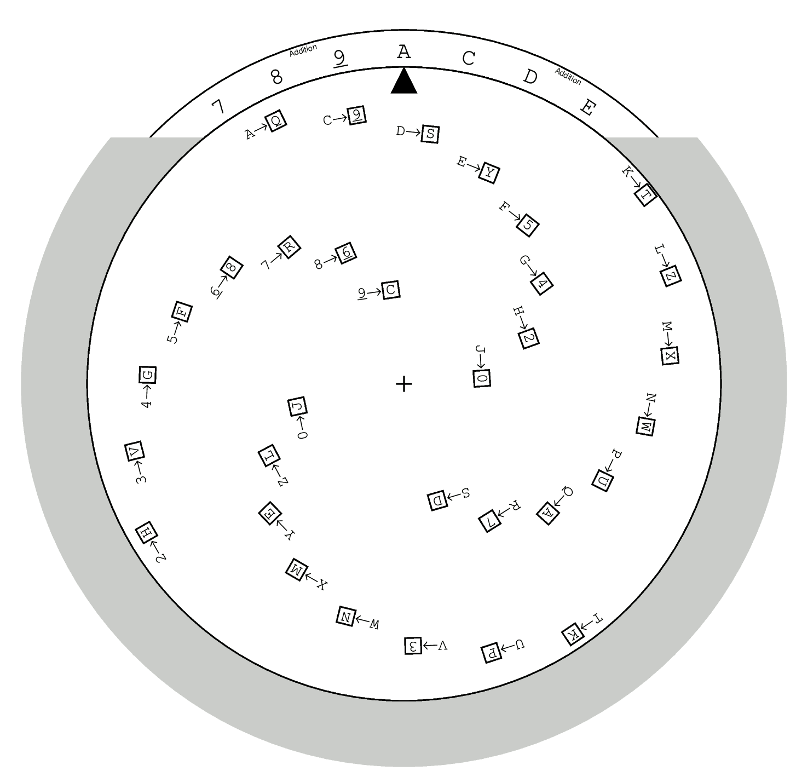
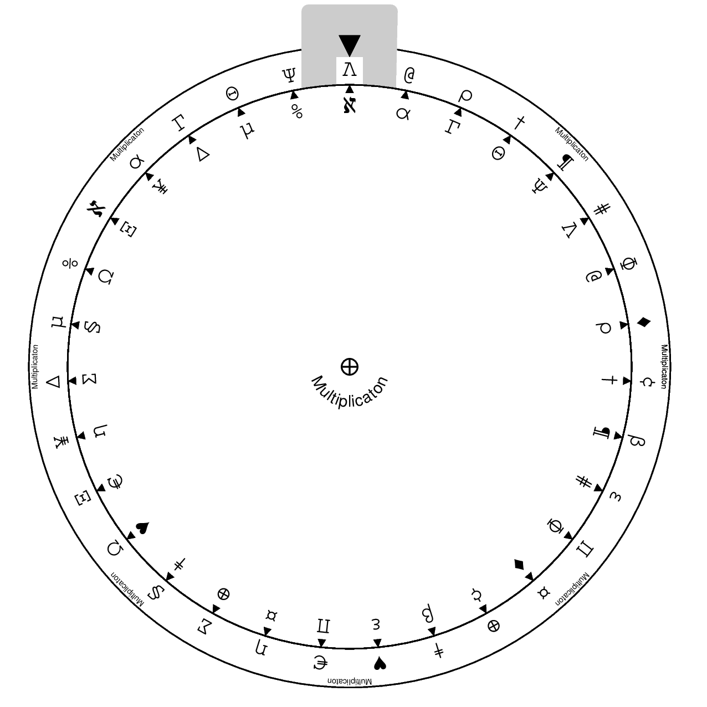

Add reference page with
* "how to pronounce the symbols" table
* bech32-to-binary and reverse tables
* header format
* URLs for the original repo and the mathematical companion

# Detailed Introduction

## Tables, Volvelles, and Slide Rulers

Throughout the checksumming, share creation and recovery, there are four kinds
of basic arithmetic that need to be done on bech32 characters and/or symbols.
Since there are only 32 characters, each of these can be compactly represented
by a lookup table.

However, the algebraic structure of this arithmetic lets us alternately represent
these operations as **volvelles** and **circular slide rules**. These are paper
computers which are constructed from circular sheets of paper or cardstock,
fastened through their centers such that they can rotate relative to each other.
Volvelles have windows in the top sheet which reveal symbols on the bottom;
slide rules have all symbols visible on both top and bottom, with arrows
indicating the mapping between symbols.

We have provided lookup tables on the Paper Computer Tables page; the paper
computer versions are in Module 0.

We have three paper computers: a Addition volvelle, a Recovery slide rule, and
a two-sided Multiplication/Translation slide rule. They are needed in the following
scenarios:
* In checksum computation and creation of initial shares, only the Addition volvelle is needed.
* To create further shares, the Translation/Multiplication slide rule is also needed.
* To recover a secret, all three paper computers are needed.

We recommend you keep the tables, and these instructions, with your stored
secrets. This way, even if you lose the paper computers (which need to be cut out
and are oddly shaped), it is still possible to work through the recovery process.
And of course, all of this is available freely on the Internet.

## Data Encoding

To store 128-bit secrets, we round 128 up to 130, so that the secret can be
represented by 26 bech32 characters. We prefix this with the 3 characters
`ms1` and a 6-character header, and suffix it with a 13-character checksum:

| Human-readable Part | Threshold | Secret ID | Share Index | Secret data | Checksum |
|---------------|--------|---------|--------|----------|----------|
| 3 characters (`ms1`) | 1 character | 4 characters | 1 character | 26 characters | 13 characters |

The components of the header are:
* The **threshold** indicates what the secret sharing threshold is, and should be
a digit between `2`and `9` inclusive. Higher threshold values are not supported.
* The **secret ID** is four arbitrary bech32 characters. They should be the same
for all shares of a given secret, but distinct between secrets.
* The **share index** indicates which share this is, and may be any bech32
character except `S`. **The secret itself will have share index `S`**,

If the user merely wants to checksum her secret, and not use secret splitting,
she should use the same format, but with the digit `0` for the threshold value
and `S` for the share index.

## Initial Share Generation

There are two scenarios that we support in this document.
* Generating a split secret with threshold k ≥ 2, such that any k shares
  can be used to regenerate the secret
* Generating a checksummed secret, without using SSSS.

In the case that the user has an existing secret in the form of BIP39 words,
a similar but more complicated process is required, which is covered in Module 1.
We do not discuss it here.

To generate a split secret, the first step is to choose your threshold k. We
require that it be between 2 and 9 inclusive, so that it can be represented by
the bech32 characters `2` through `9`. Then take the k initial characters from
the bech32 alphabet (`A`, `C`, `D`, and so on), and for each one:

1. Construct a 6-character header, as described above, with the initial character
   as the share index.
2. Generate 26 random characters, representing 130 bits of entropy. Use the Dice
   Worksheet for instructions on doing this. Add these characters after the header.
3. Generate a 13-character checksum, following the instructions on the Checksum
   Worksheet.

The checksum worksheet is likely to take 30-90 minutes, depending on user proficiency
with the Addition volvelle. Even though this is a long time, we strongly recommend
doing it twice, because mistakes made during checksum computation cannot be
corrected after the fact.

If you are not planning to use SSSS, the instructions are exactly the same, except
that you should generate the single share `S` rather than k initial shares, and
set the threshold value in the header to `0`.

## Derived Share Generation

The k initial shares together actually form a set of k-of-k SSSS shares. However,
the user likely would like a k-of-n scheme where n is bigger than k. In this case,
the user needs to create (n-k) additional "derived" shares. These are not generated
randomly but instead derived from the initial shares.

The steps are as follows:

1. Follow the instructions on the "Constructing Shares" worksheet: for each of your
   iniital shares, look up a translation symbol in the provided tables and translate
   that share using the Translation volvelle. Then add all the translated shares
   using the Addition volvelle.
2. The result will be a new share, miraculously with a well-formed header and a valid
   checksum. To validate this checksum, fill out a fresh Checksum Worksheet with the
   new share.

It is very likely that you will make mistakes during this process, resulting in a bad
checksum. Mistakes during the translation step are correctable, but the error correction
process involves computers and is not necessary here since the user has all the data
she needs. Further, a bad checksum is just as likely to have resulted from incorrect
computations in the Checksum Worksheet, which the error correction process cannot handle.

The most straightforward way to handle a wrong checksum is to redo the entire share
derivation step, checking each calculation against the first time you did it.

There is a less demoralizing, but more time-consuming, way to do the share derivation
process:

1. Before beginning, make sure you have complete Checksum Worksheets for all of your
   initial shares (if you just generated these, the worksheets should be readily available).
2. Start the Checksum Worksheet for your derived share, copying the translated share
   into the bold boxes as usual.
3. Repeat the translation-and-adding process, this time taking the **bottom diagonal
   squares** from the initial Checksum Worksheets and combining these. Copy the
   result into the bottom diagonal of the new Checksum Worksheet.
4. Write the target residue `SECRETSHARE32` at the bottom of the Checksum Worksheet.
5. Now filling in the rest of the Checksum Worksheet as usual. If you ever compute a
   value that doesn't match one of your pre-filled squares, you know the mistake was
   in that column. Redo the computations *just for that column* before continuing.

## Distribution of Shares

Once the shares have been generated, there is no difference between the initial and
derived shares. Distribute these as you wish.

You can generate up to 31 total shares before running out of available letters for
share indices. You can make multiple copies of shares, but of course remember that
only one copy counts during recovery: you need k *distinct* shares to recover your
secret.

## Recovery

Once you have generated and (distributed) your shares, you may like to recover your
secret. In the future, we hope that hardware wallets will accept input of shares
and do the recovery themselves, but we assume for this section that you want to
recover your secret by hand.

First, make sure you have k shares available. Exactly k are needed; if you have
more, then just set the extras aside.

The process is then very similar to the process for share derivation, except that
rather than looking up symbols in a provided table, you use the Recovery Wheel
volvelle to compute them as follows:

1. Complete Checksum Worksheets for the k shares you are using. (This is not strictly
   necessary, but if any mistakes happen during the recovery process it's helpful to
   be confident in your original shares' correctness.)
2. For each share that you have,
   1. Spin the Recovery slide chart so its pointer is
      at its share index. Read the symbol corresponding to **each other share**.
   2. Multiply each of these symbols together using the Multiplication slide chart,
      by turning the pointer to one symbol, looking up the next, then spinning the
      wheel to the position you just looked up. (For k = 2 you will have only one
      symbol, so this step is trivial: just spin the Multiplication slide chart to
      that symbol.)
   3. Leave the Multiplication slide chart pointed at the result of the previous step,
      and flip it over. It is now the Translation slide chart.
   4. Translate the share, character by character.
3. Add the translated shares. The result will magically have a valid header and
   share index `S`. This is your secret. Keep it safe.
4. Complete a Checksum Worksheet for the derived secret.

As during share derivation, if you use the checksum worksheets for your input shares,
and repeat the translate-and-add process for the cells in the bottom diagonal, you
can identify mistakes as soon as they happen, avoiding the need to repeat tons of
work if you mess up.

